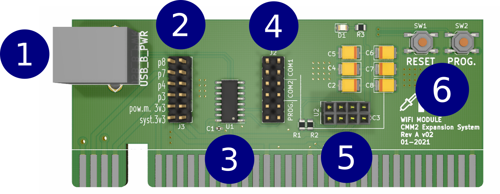
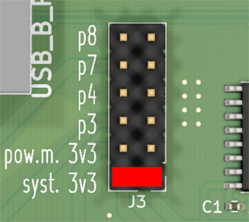
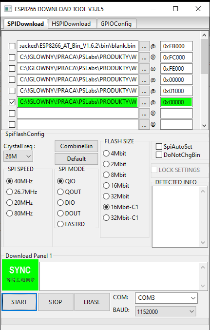

# CMM2-ExpansionCard-WiFi

This card adds wifi functionality, includes USB to RS chip allowing easy flashing and communication with pc

Expansion system and cards can be purchased here: [PS Labs](https://sklep.pslabs.pl/Maximite-c91)

1. USB B connector for flashing ESP01 from PC
2. Power source selector
3. USB to UART converter
4. Port com and flashing selector
5. Socket for ESP01
6. Flashing buttons

# WARNING!

Expansion card have to have edges chamfered, using unchamfered card will result in slot damage.

# Assembly
1. Cut goldpin headers with pliers to correct length and install J2, J3
2. Install 2x4 U2 socket
3. Install USB B J1 socket
4. Insert ESP01 module to U2 socket

# Power supply selector
Use J3 to select from what power source card should be powered:
p3, p4, p7, p8 - p power sources (currently not used)
pow,m, 3v3 - power from power module card
syst. 3v3 - power from Maximite

# WARNING!
Use only one power source (1 jumper allowed)

Example:

This example shows power selected from 3.3V rail from Maximite

# Flashing ESP01 module

1. Connect card to expansion system, cards needs to be powered
2. Install ESP01 module in U2 socket
3. Connect USB A-B cable to PC and card
4. Find out which COM port is detected by PC
5. Select COM port in Your flashing tool
6. Start flash
7. On WiFi card hold PROG. button and press RESET button while still holding PROG. button
8. Wait until flash compleats and disconnect card from PC
